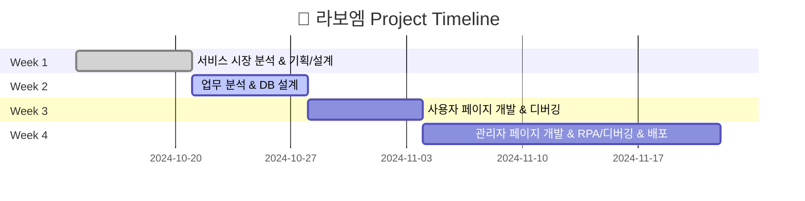

# 📓 라보엠 (La Poem)  
_“책을 통해 사람과 사람, 그리고 사람과 인공지능이 소통하는 공간”_

---

## ⚙️ 기술 스택

|  |
|---|
| **OpenAI API**   챗봇 **스텔라** 구현 (대화형 AI) |

|  |  |  |  |
|---|---|---|---|
| **React**   프론트엔드 개발 | **Node.js**   백엔드 서버 | **Python**   AI/챗봇 개발 | **PostgreSQL**   데이터베이스 관리 |

|  |  |  |  |
|---|---|---|---|
| **GitHub**   형상 관리, 협업 | **Jenkins**   CI/CD 자동화 | **Docker**   컨테이너 환경 구축 | **Docker Hub**   이미지 배포 저장소 |

---

## ✨ 소개
**라보엠(La Poem)** 은 프랑스어 **“Le poème(르 포엠)”** 에서 유래하여  
‘시적인 독서 체험’을 추구하는 **도서 커뮤니티 플랫폼**이다.

- 1️⃣ 책을 매개로 한 깊이 있는 소통  
- 2️⃣ 사용자 간 자유로운 생각 공유  
- 3️⃣ AI 챗봇 **스텔라(Stella)** 와의 독서 토론  

---

## ✨ 서비스 핵심 가치
> "책을 공유하고, 토론하고, 기록하는 모든 순간을 더 재밌고 풍부하게"

- **사람 ↔ 사람**: 커뮤니티를 통한 깊이 있는 독서 토론  
- **사람 ↔ 인공지능**: 챗봇 스텔라와의 새로운 독서 경험  
- **개인 ↔ 취향 데이터**: 맞춤형 도서 추천  

---

## ✨ 주요 기능

<table>
<tr>
<td align="center">📖 Book List</td>
<td align="center">💬 Communication</td>
<td align="center">🤖 Chat Stella</td>
<td align="center">🛠 Admin</td>
</tr>
<tr>
<td>

- 도서 목록 조회  
- 상세 페이지 (책 정보, 별점 분포도, 리뷰)

</td>
<td>

- 스레드온: 도서별 토론 스레드  
- 자유 게시판 & 인기 게시글/회원 랭킹  

</td>
<td>

- AI 챗봇 스텔라와 독서 토론  
- 감상 정리 및 글쓰기 지원  

</td>
<td>

- 도서 등록/삭제  
- 베스트셀러 및 신간 알림 관리  

</td>
</tr>
</table>

---

## ✨ 기대 효과
- 독서 애호가들이 **생각을 자유롭게 공유할 수 있는 공간**  
- 커뮤니티 데이터를 기반으로 **AI 챗봇 학습 리소스 확보**  
- 인기 독후감/리뷰 **템플릿 제공**  
- 취향 기반 **맞춤 도서 추천**  

---

## ✨ 프로젝트 일정 (WBS)

